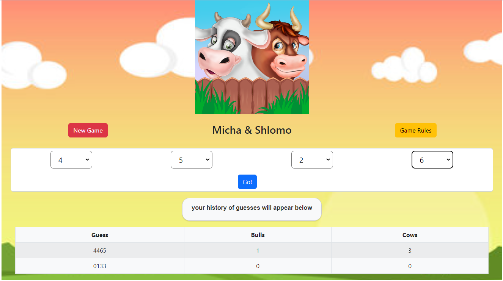
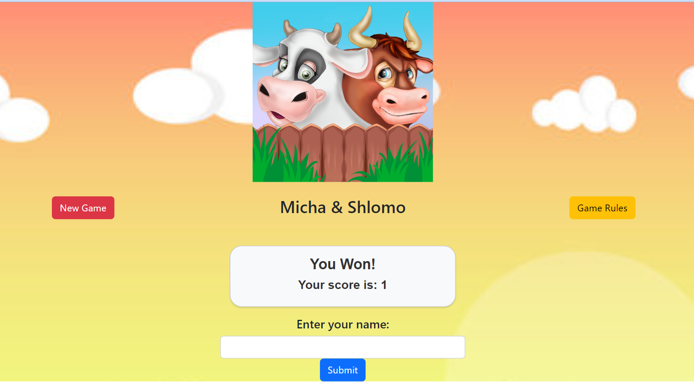
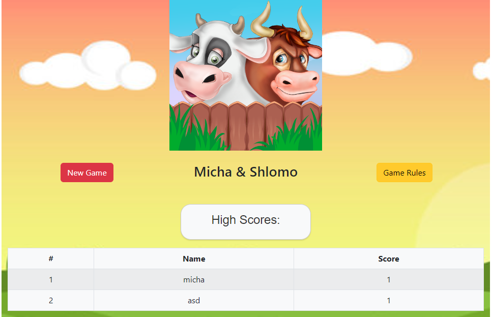

# Bulls and Cows

# Authors
* Name: Micha Briskman 

# Technologies
* Client side - React
* Server side - Spring, java
* Server - Tomcat 9.0.73
* Database - SQL

# About
Bulls and Cows is a classic guessing game also known as "Mastermind." It's a two-player game where the computer generates a secret sequence of digits and the player tries to guess the code. The game is played with a 4-digit code.  
The game is played on the client side.  
There are 3 main pages: GamePage, RegisterPage, HighScorePage.
### Rules
Objective: The goal of the game is for the guessing player to figure out the secret code.  
Making a Guess: The player makes a guess at what the secret code might be. The guess should also be a 4-digit sequence without repeating digits.
Scoring:
A "Bull" is scored for each correct digit that is in the correct position. 
A "Cow" is scored for each correct digit that is in the wrong position. 

### GamePage

### RegistePage

### HighScorePage

